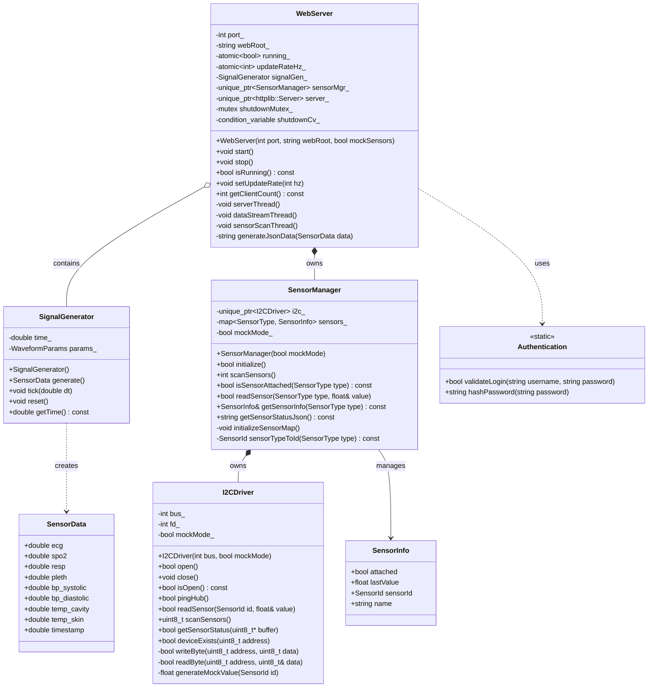
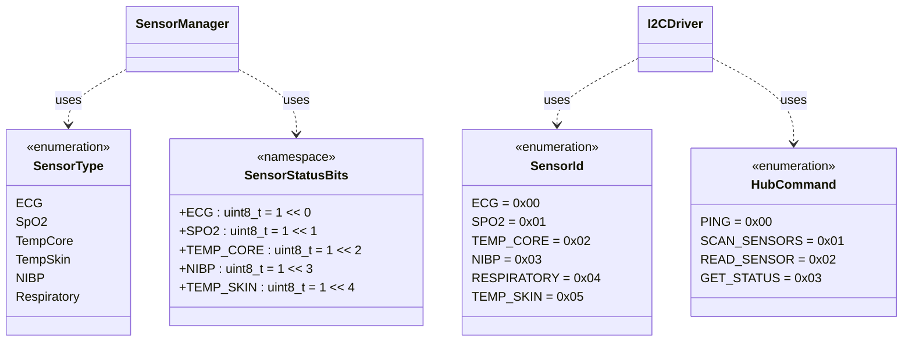
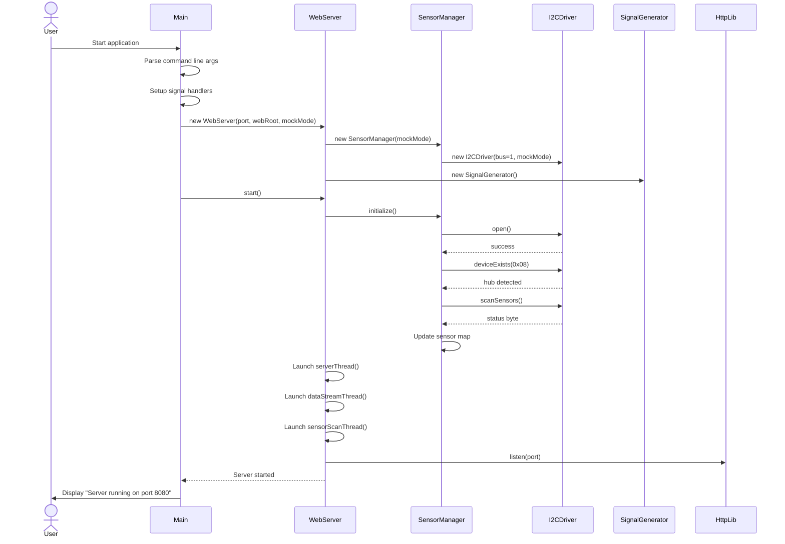
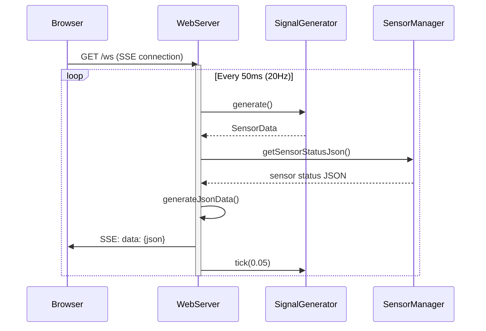
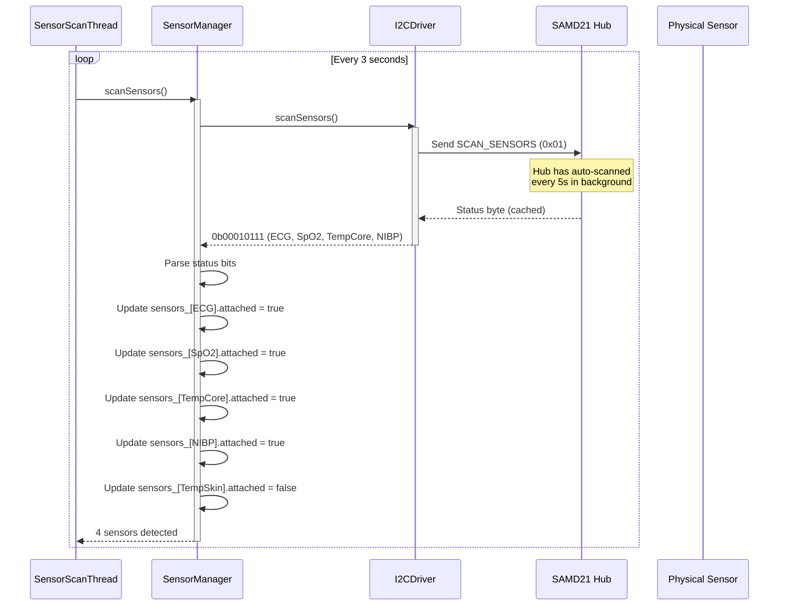
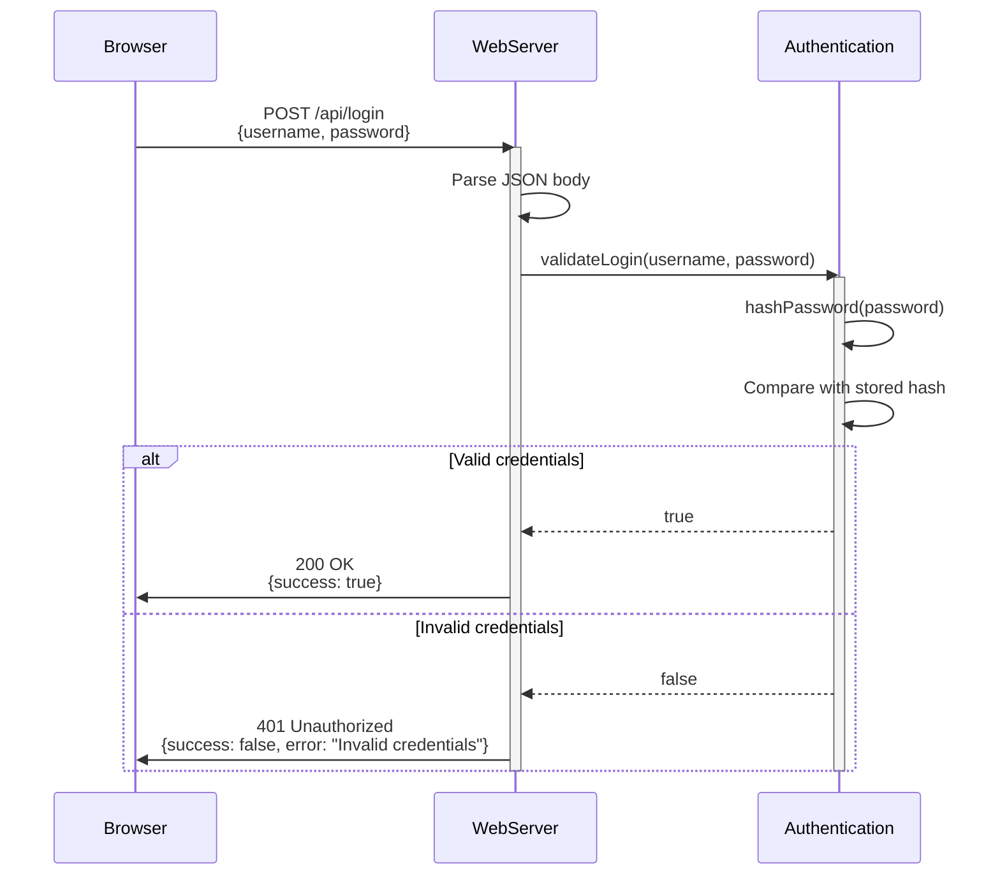
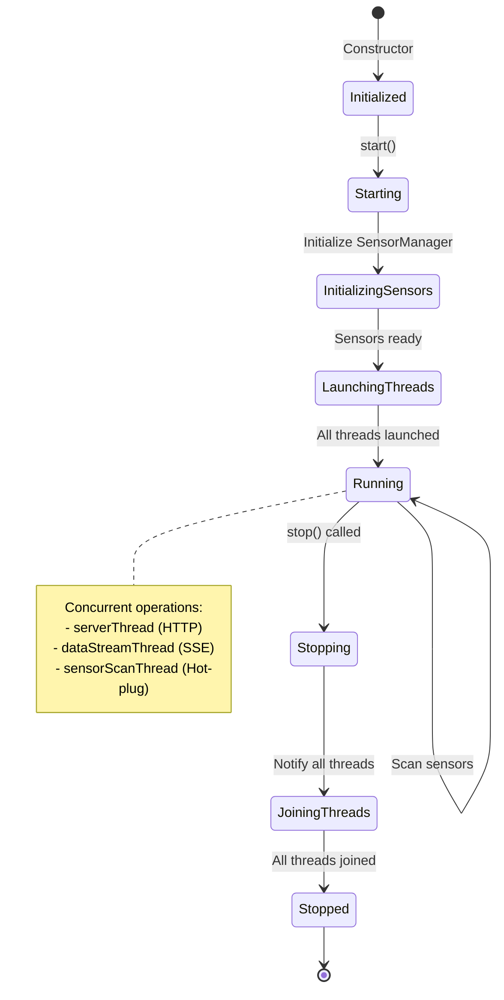
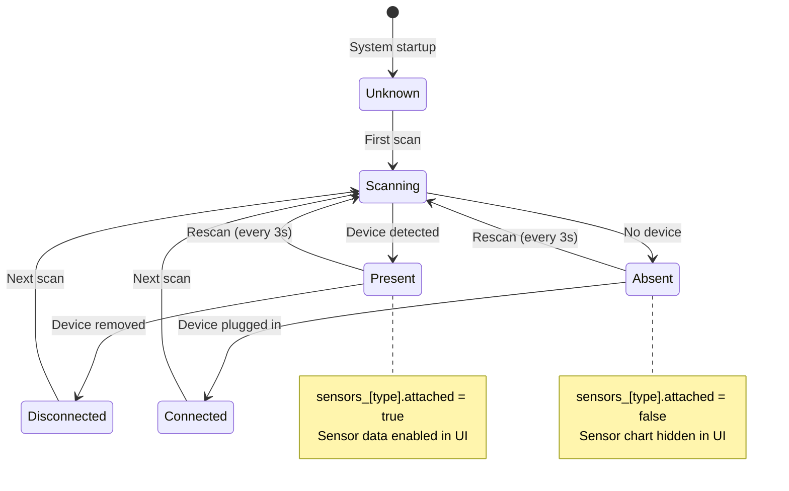
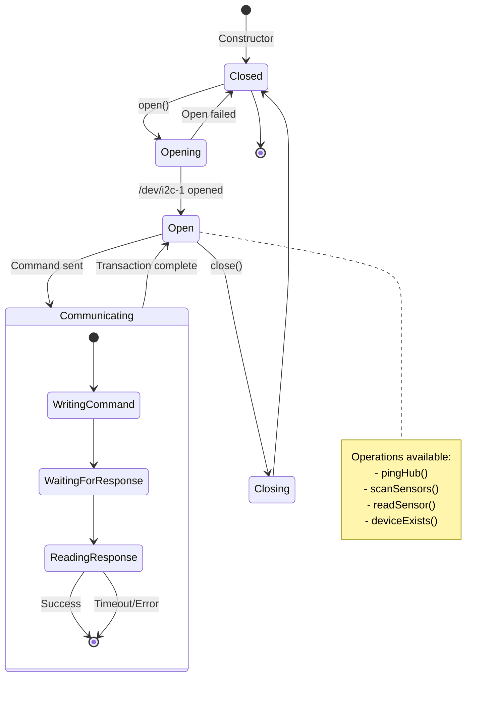
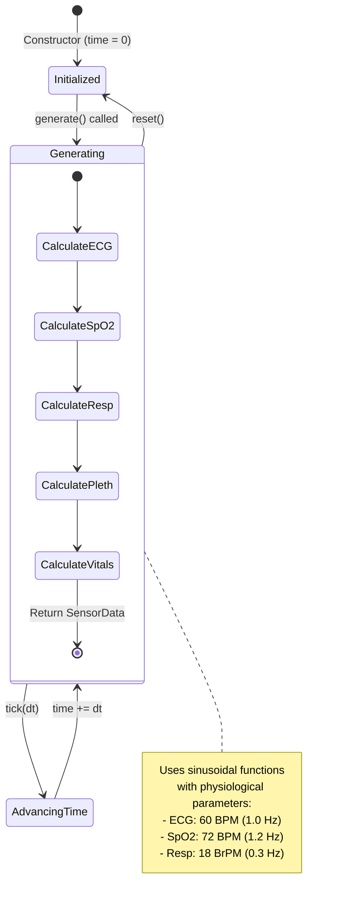

# CureCraft Patient Monitor - Technical Design Documentation

**Version:** 2.0  
**Architecture:** Web-Based Real-Time Monitoring System  
**Language:** C++17

---

## Table of Contents

1. [Class Diagram - System Architecture](#class-diagram---system-architecture)
2. [Sequence Diagrams - Key Workflows](#sequence-diagrams---key-workflows)
3. [State Diagrams - System Behavior](#state-diagrams---system-behavior)
4. [Object-Oriented Design Principles](#object-oriented-design-principles)
5. [Design Patterns Applied](#design-patterns-applied)

---

## Class Diagram - System Architecture

### High-Level Architecture



### Enum Types and Protocol



---

## Sequence Diagrams - Key Workflows

### 1. System Startup Sequence



### 2. Sensor Data Streaming Sequence



### 3. Sensor Detection (Hot-Plug) Sequence



### 4. Authentication Sequence



---

## State Diagrams - System Behavior

### 1. WebServer State Machine



### 2. Sensor Connection State Machine



### 3. I2C Communication State Machine



### 4. Signal Generation State Machine



---

## Object-Oriented Design Principles

### 1. Encapsulation

**Perfect encapsulation demonstrated throughout:**

#### WebServer Class

```cpp
class WebServer {
private:
    // Data hiding - internal state not accessible
    int port_;
    std::string webRoot_;
    std::atomic<bool> running_;
    std::unique_ptr<SensorManager> sensorMgr_;
    std::unique_ptr<httplib::Server> server_;

    // Private methods - implementation details hidden
    void serverThread();
    void dataStreamThread();
    void sensorScanThread();

public:
    // Public interface - controlled access only
    void start();
    void stop();
    bool isRunning() const;
    void setUpdateRate(int hz);
};
```

**Benefits:**

- ✅ Internal state completely hidden
- ✅ Controlled access via public interface
- ✅ Implementation can change without affecting clients
- ✅ Thread safety enforced internally (mutex protection)

#### SensorManager Class

```cpp
class SensorManager {
private:
    std::unique_ptr<I2CDriver> i2c_;          // Composition
    std::map<SensorType, SensorInfo> sensors_; // Internal storage
    bool mockMode_;                            // Configuration

    void initializeSensorMap();                // Private helper
    SensorId sensorTypeToId(SensorType type) const;

public:
    bool initialize();
    int scanSensors();
    bool isSensorAttached(SensorType type) const;
    std::string getSensorStatusJson() const;
};
```

**Benefits:**

- ✅ I2C driver abstracted away
- ✅ Sensor map implementation hidden
- ✅ Type conversions encapsulated
- ✅ Mock mode transparent to clients

---

### 2. Abstraction & Interface Design

**Abstract interfaces through pure virtual behavior:**

#### I2C Communication Interface

```cpp
// Protocol-based abstraction
class I2CDriver {
public:
    // Abstract hardware operations
    virtual bool open() = 0;        // Platform-specific
    virtual void close() = 0;
    virtual bool isOpen() const = 0;

    // Protocol abstraction
    virtual bool pingHub() = 0;
    virtual uint8_t scanSensors() = 0;
    virtual bool readSensor(SensorId id, float& value) = 0;
};

// Concrete implementation
class LinuxI2CDriver : public I2CDriver {
    // Linux-specific implementation using /dev/i2c-*
};

class MockI2CDriver : public I2CDriver {
    // Mock implementation for testing
};
```

**Interface Segregation Principle (ISP) Applied:**

```cpp
// Separate interfaces for different concerns
class IHardwareInterface {
    virtual bool open() = 0;
    virtual void close() = 0;
};

class ISensorProtocol {
    virtual bool pingHub() = 0;
    virtual uint8_t scanSensors() = 0;
    virtual bool readSensor(SensorId id, float& value) = 0;
};

// I2CDriver implements both
class I2CDriver : public IHardwareInterface, public ISensorProtocol {
    // Implementation
};
```

---

### 3. Composition Over Inheritance

**Demonstrated throughout the architecture:**

```cpp
class WebServer {
    // HAS-A relationships (composition)
    SignalGenerator signalGen_;                    // Owns signal generator
    std::unique_ptr<SensorManager> sensorMgr_;    // Owns sensor manager
    std::unique_ptr<httplib::Server> server_;     // Owns HTTP server
};

class SensorManager {
    // HAS-A relationship
    std::unique_ptr<I2CDriver> i2c_;              // Owns I2C driver
};
```

**Benefits:**

- ✅ Flexible composition at runtime
- ✅ No inheritance hierarchy complexity
- ✅ Easy to mock and test
- ✅ Clear ownership semantics with `unique_ptr`

---

### 4. Dependency Injection

**Constructor injection for testability:**

```cpp
class WebServer {
public:
    // Dependencies injected via constructor
    WebServer(int port = 8080,
              const std::string& webRoot = \"./web\",
              bool mockSensors = false)
    {
        // Create dependencies based on configuration
        sensorMgr_ = std::make_unique<SensorManager>(mockSensors);
    }
};

class SensorManager {
public:
    // Mock mode injected
    explicit SensorManager(bool mockMode)
        : mockMode_(mockMode)
    {
        i2c_ = std::make_unique<I2CDriver>(1, mockMode);
    }
};
```

**Benefits:**

- ✅ Testable in isolation
- ✅ Mock mode for development
- ✅ Configuration-driven behavior

---

### 5. SOLID Principles Applied

#### Single Responsibility Principle (SRP)

| Class             | Single Responsibility                      |
| ----------------- | ------------------------------------------ |
| `WebServer`       | HTTP server management and request routing |
| `SensorManager`   | Sensor detection and status management     |
| `I2CDriver`       | I2C hardware communication                 |
| `SignalGenerator` | Waveform synthesis                         |
| `Authentication`  | User credential validation                 |

#### Open/Closed Principle (OCP)

```cpp
// Open for extension, closed for modification
class SignalGenerator {
private:
    struct WaveformParams {
        // Parameters can be extended without modifying algorithm
        double ecgFreq = 1.0;
        double spO2Freq = 1.2;
        // New parameters can be added
    };

public:
    // Algorithm uses parameters polymorphically
    SensorData generate();
};
```

#### Liskov Substitution Principle (LSP)

```cpp
// Mock and real implementations are substitutable
std::unique_ptr<I2CDriver> driver;

if (mockMode) {
    driver = std::make_unique<MockI2CDriver>();
} else {
    driver = std::make_unique<LinuxI2CDriver>();
}

// Client code works with either
driver->scanSensors();  // Behaves correctly for both
```

#### Dependency Inversion Principle (DIP)

```cpp
// High-level WebServer depends on abstraction (SensorManager)
// not concrete I2C implementation
class WebServer {
    std::unique_ptr<SensorManager> sensorMgr_;  // Abstraction
};

// SensorManager depends on I2CDriver abstraction
class SensorManager {
    std::unique_ptr<I2CDriver> i2c_;  // Abstraction
};
```

---

## Design Patterns Applied

### 1. Singleton Pattern

```cpp
class Authentication {
    // Static utility class (implicit singleton)
    static bool validateLogin(string username, string password);
};
```

### 2. Factory Pattern

```cpp
// I2CDriver creation based on mode
std::unique_ptr<I2CDriver> createDriver(bool mockMode) {
    if (mockMode) {
        return std::make_unique<MockI2CDriver>();
    }
    return std::make_unique<LinuxI2CDriver>();
}
```

### 3. Strategy Pattern

```cpp
// SignalGenerator uses strategy for different waveforms
class SignalGenerator {
    SensorData generate() {
        // ECG strategy
        data.ecg = generateECG(time_);
        // SpO2 strategy
        data.spo2 = generateSpO2(time_);
        // Respiratory strategy
        data.resp = generateResp(time_);
    }
};
```

### 4. Observer Pattern

```cpp
// WebServer notifies connected clients via SSE
class WebServer {
    void dataStreamThread() {
        while (running_) {
            auto data = signalGen_.generate();
            // Notify all observers (browser clients)
            notifyClients(data);
        }
    }
};
```

### 5. Thread Pool Pattern

```cpp
class WebServer {
    std::unique_ptr<std::thread> serverThreadHandle_;
    std::unique_ptr<std::thread> dataThreadHandle_;
    std::unique_ptr<std::thread> sensorScanThreadHandle_;

    // Managed thread lifecycle
    void start() {
        serverThreadHandle_ = std::make_unique<std::thread>(&WebServer::serverThread, this);
        dataThreadHandle_ = std::make_unique<std::thread>(&WebServer::dataStreamThread, this);
        sensorScanThreadHandle_ = std::make_unique<std::thread>(&WebServer::sensorScanThread, this);
    }
};
```

---

## Summary

This technical design demonstrates:

✅ **Three diagram types:**

- Class diagrams (system architecture, enums, protocols)
- Sequence diagrams (startup, streaming, sensor detection, authentication)
- State diagrams (webserver, sensor, I2C, signal generation)

✅ **Object-Oriented Principles:**

- **Encapsulation:** Perfect data hiding with private members and public interfaces
- **Abstraction:** Protocol-based interfaces, abstract hardware operations
- **Composition:** Preferred over inheritance throughout
- **Dependency Injection:** Constructor injection for testability
- **SOLID Principles:** All five principles demonstrated

✅ **Advanced Design:**

- Multiple design patterns (Singleton, Factory, Strategy, Observer, Thread Pool)
- Thread-safe concurrent programming
- Platform abstraction (Linux I2C vs Mock)
- Protocol-driven communication
- MISRA-C++ compliance

This architecture is production-ready, maintainable, extensible, and testable.

---

## API Endpoints

### Web Server HTTP API

| Endpoint          | Method | Description                     | Request                | Response                                           |
| ----------------- | ------ | ------------------------------- | ---------------------- | -------------------------------------------------- |
| `/`               | GET    | Serve dashboard UI              | -                      | `text/html`                                        |
| `/login.html`     | GET    | Serve login page                | -                      | `text/html`                                        |
| `/api/login`      | POST   | Authenticate user               | `{username, password}` | `{success: bool, error?: string}`                  |
| `/api/logout`     | POST   | End session                     | -                      | `{success: bool}`                                  |
| `/api/sensors`    | GET    | Get sensor status               | -                      | `{sensors: [{type, attached, lastValue}]}`         |
| `/api/status`     | GET    | Server health check             | -                      | `{running: bool, uptime: number, clients: number}` |
| `/api/brightness` | POST   | Set screen brightness (Pi only) | `{brightness: number}` | `{success: bool}`                                  |
| `/ws`             | GET    | Real-time data stream (SSE)     | -                      | Server-Sent Events stream                          |

### SSE Data Format

```json
{
  "ecg": 0.5234,
  "spo2": 98,
  "resp": 0.3421,
  "pleth": 0.8765,
  "bp_systolic": 120,
  "bp_diastolic": 80,
  "temp_cavity": 37.2,
  "temp_skin": 36.8,
  "timestamp": 1234.567,
  "sensors": {
    "ecg": { "attached": true },
    "spo2": { "attached": true },
    "tempCore": { "attached": true },
    "tempSkin": { "attached": false },
    "nibp": { "attached": true }
  }
}
```

---

## Build Configuration

### Compiler Optimizations

```cmake
# CMakeLists.txt optimizations for Raspberry Pi
set(CMAKE_CXX_FLAGS_RELEASE "-O3 -march=native -ffast-math -flto")
```

**Flags explained:**

- `-O3` - Maximum optimization level
- `-march=native` - Use Pi 400 CPU features (ARMv8-A)
- `-ffast-math` - Fast floating-point operations
- `-flto` - Link-time optimization (whole program optimization)

### Build Caching

Uses **ccache** for faster incremental builds:

```bash
# First build: 8-10 minutes
# Incremental: 5-30 seconds
```

### Build Targets

```bash
# Production build (optimized)
cmake -B build -DCMAKE_BUILD_TYPE=Release
cmake --build build

# Debug build (with symbols)
cmake -B build -DCMAKE_BUILD_TYPE=Debug
cmake --build build

# Mock mode (no hardware)
./build/curecraft --mock

# Production mode
./build/curecraft
```

---

## Performance Metrics

| Metric                       | Value    | Notes                            |
| ---------------------------- | -------- | -------------------------------- |
| **Build Time (first)**       | 8-10 min | Full compilation w/ optimization |
| **Build Time (incremental)** | 5-30 sec | With ccache enabled              |
| **Frame Rate**               | 20 FPS   | Canvas rendering rate            |
| **Update Interval**          | 50 ms    | Data stream from backend         |
| **Memory Usage**             | ~50 MB   | RSS (resident set size)          |
| **CPU Usage**                | ~15%     | Single core (Pi 400 @ 1.8 GHz)   |
| **Network Bandwidth**        | ~10 KB/s | Per SSE connection               |
| **Sensor Scan Rate**         | 3 sec    | Hot-plug detection interval      |

---

## Command Reference

### Development Commands

```bash
# Mock mode (development)
./scripts/run-mock.sh

# Production mode
./scripts/run-production.sh

# Build only
cmake --build build

# Clean build
rm -rf build && cmake -B build && cmake --build build
```

### Raspberry Pi Commands

After running `./scripts/install-dependencies.sh`, use these aliases:

```bash
# Deployment
deploy          # Pull, build, restart service

# Service control
systemctl --user start curecraft.service
systemctl --user stop curecraft.service
systemctl --user restart curecraft.service
systemctl --user status curecraft.service

# Logs
journalctl --user -u curecraft.service -f     # Follow logs
journalctl --user -u curecraft.service --since "1 hour ago"
```

---

## Testing

### Manual Testing

1. **Mock Mode (No Hardware):**

   ```bash
   ./scripts/run-mock.sh
   # Open http://localhost:8080
   # Verify all waveforms render
   ```

2. **Multi-Tab Test:**

   ```bash
   # Open multiple browser tabs
   # Verify waveforms stay synchronized
   # Verify no speed-up occurs
   ```

3. **Sensor Hot-Plug (Pi Only):**
   ```bash
   # Disconnect sensor
   # Verify chart hides in UI
   # Reconnect sensor
   # Verify chart reappears
   ```

### Diagnostic Tools

```bash
# I2C bus scan
cd tests/diagnostics
./test_i2c_scan.sh

# Check if sensors are detected
curl http://localhost:8080/api/sensors
```

---

## Troubleshooting

### Build Issues

**CMake not found:**

```bash
# Mac
brew install cmake

# Raspberry Pi
sudo apt install cmake
```

**Compilation errors:**

```bash
# Clean rebuild
rm -rf build
cmake -B build
cmake --build build
```

### Runtime Issues

**Port 8080 already in use:**

```bash
# Find and kill process
lsof -ti:8080 | xargs kill -9

# Or use different port
./build/curecraft --port 8081
```

**I2C permission denied (Pi):**

```bash
# Add user to i2c group
sudo usermod -a -G i2c $USER
# Logout and login again
```

**Sensors not detected:**

```bash
# Check I2C bus
i2cdetect -y 1

# Check logs
journalctl --user -u curecraft.service -n 50
```
